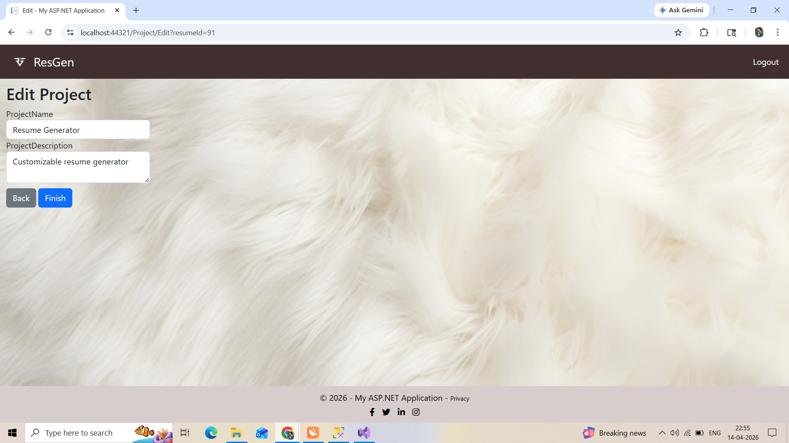
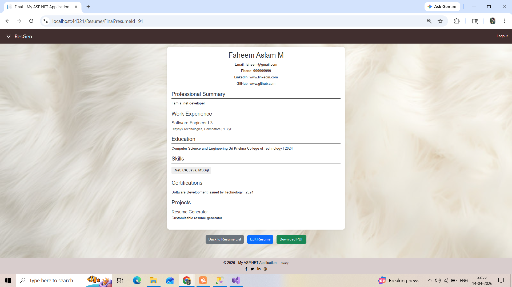

# 💼 Resume Generator (ASP.NET MVC)

A web-based Resume Generator application built using ASP.NET MVC and SQL Server. This application allows users to create, preview, and download professional resumes quickly.

---

## 🚀 Features

- 📝 Add personal details
- 🎓 Add education details
- 💼 Add work experience
- 🛠️ Add skills
- 📄 Generate resume instantly
- ⬇️ Download resume

---

## 🧑‍💻 Technologies Used

- ASP.NET MVC
- C#
- SQL Server
- HTML, CSS, JavaScript

---

## 🔐 Demo Login Credentials

Use the below credentials to access the application:

**User Login:**
- Username: faheem@gmail.com
- Password: aslam

---

## 🗄️ Database Setup

1. Open SQL Server
2. Run the provided `resume_generator_script.sql` file
3. Update the connection string in `Web.config`

---

## ▶️ How to Run the Project

1. Open the project in Visual Studio
2. Restore NuGet packages
3. Build the solution
4. Run the application

---

## 📸 Screenshots

### 🏠 Home Page

### Signin
(Resume_Generator_Screenshots/SignIn.png)

### Templates
(Resume_Generator_Screenshots/Templates.png)

### 📝 Details Filling

### 📄 Generated Resume

---

## 📌 Project Highlights

- Simple and user-friendly interface
- Structured MVC architecture
- Real-time resume generation

---

## 🙋‍♂️ Author

**Faheem Aslam**  
.NET Developer | Open to Freelance Work

---

## 📬 Contact

- Available for freelance projects (Development & Bug Fixing)
- Email : faheemasla@gmail.com
- Number : 9786590781
